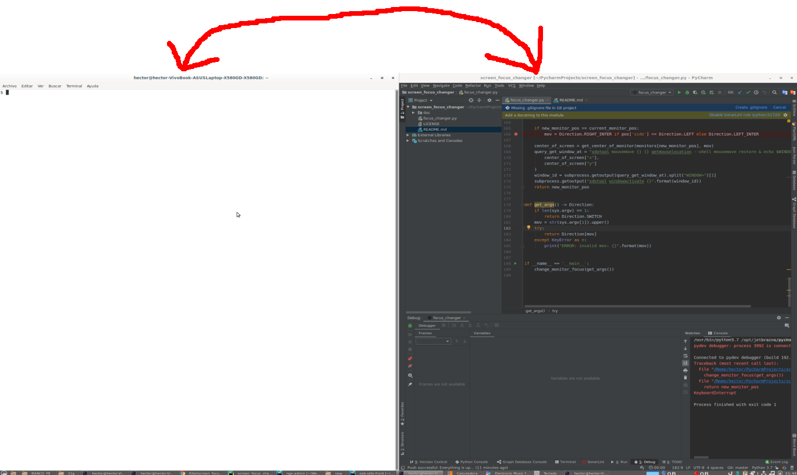

can be useful to create a shortcut that allows you to switch between monitors / screens

If you have only one monitor, it can also be used to switch between tiled windows 

install:

sudo apt install xdotool x11-xserver-utils

usage:

To set focus to left screen pass "left" as arg

python3 ./focus_changer.py left

To set focus to right screen pass "right" as arg

usage python3 ./focus_changer.py right
