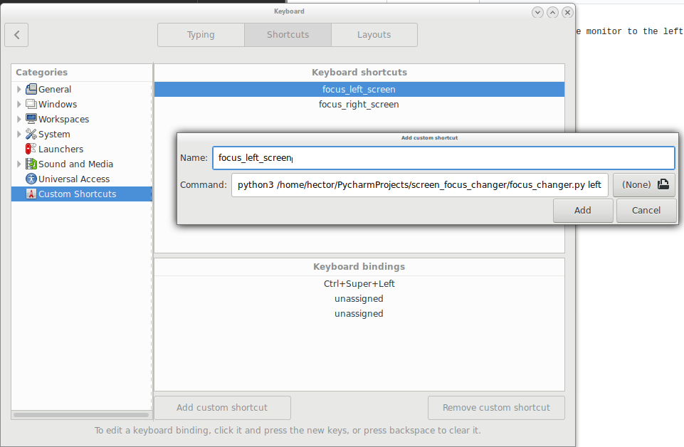

can be useful to create a shortcut that allows you to switch between monitors / screens

usage:

To set focus to left screen pass "left" as arg
python3 ./focus_changer.py left

To set focus to right screen pass "right" as arg
usage python3 ./focus_changer.py right
